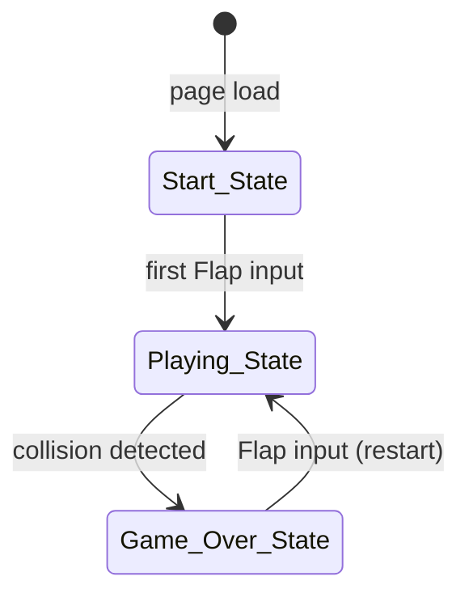
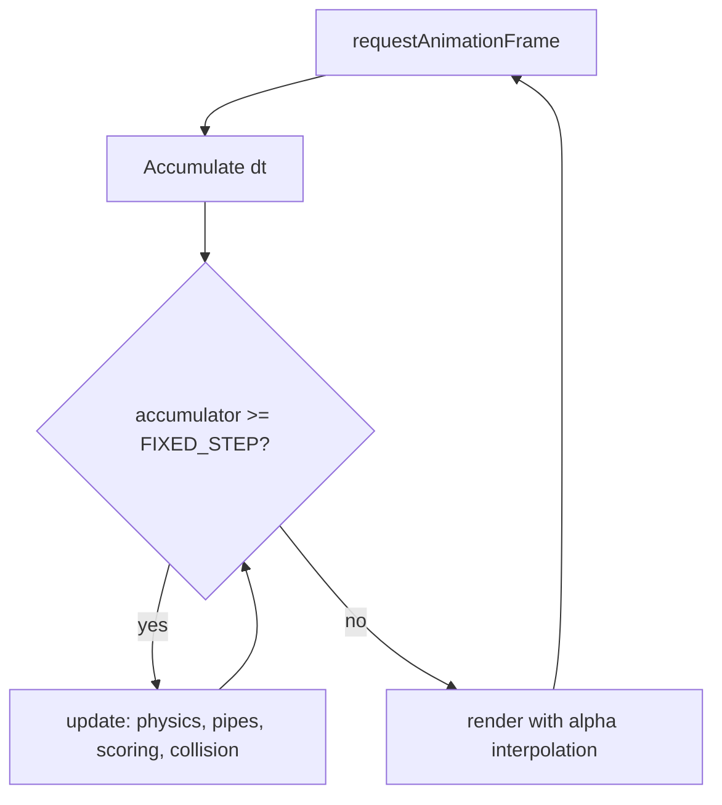

# Design Document: Flappy Kiro

## Overview

Flappy Kiro is a self-contained, browser-based endless scroller game implemented in a single HTML file with vanilla JavaScript and no external dependencies. The player guides a ghost sprite (Ghosty) through an infinite series of pipe obstacles by tapping or pressing Space to flap upward against gravity.

The game runs on a fixed-timestep game loop with linear interpolation for smooth rendering at variable frame rates. All game state is managed in plain JavaScript objects; there is no framework, bundler, or server component. Assets (`ghosty.png`, `jump.wav`, `game_over.wav`) are loaded from the `assets/` directory at startup.

Key design goals:
- Zero-dependency: one HTML file + asset files, open in any browser
- Deterministic physics via named constants and fixed-timestep updates
- Clean state machine (Start → Playing → Game Over → Playing)
- Property-testable core logic (physics, collision, scoring) isolated from rendering

---

## Architecture

The game is structured as a single HTML file containing one `<script>` block. Logical concerns are separated into clearly named functions and constant groups, but there is no module system or class hierarchy — plain functions and a shared mutable state object keep the implementation minimal.



### Game Loop Architecture

The loop uses `requestAnimationFrame` with a fixed-timestep accumulator pattern:

```
requestAnimationFrame(timestamp)
  → accumulate elapsed time
  → while (accumulator >= FIXED_STEP) { update(FIXED_STEP); accumulator -= FIXED_STEP; }
  → alpha = accumulator / FIXED_STEP
  → render(alpha)
```

This decouples physics updates (fixed rate, deterministic) from rendering (variable rate, interpolated), satisfying Requirement 4b.5.



---

## Components and Interfaces

### Constants Block

All tunable values are defined as named constants at the top of the script:

```js
const GRAVITY           = 0.5;   // px/frame² downward acceleration
const FLAP_VELOCITY     = -9;    // px/frame upward impulse on flap
const TERMINAL_VELOCITY = 12;    // px/frame max downward speed
const FIXED_STEP        = 1000 / 60; // ms per physics tick (~16.67ms)

const CANVAS_W          = 480;
const CANVAS_H          = 640;
const SCORE_BAR_H       = 40;    // height of score strip at bottom
const PLAY_H            = CANVAS_H - SCORE_BAR_H; // usable play area height

const PIPE_WIDTH        = 60;
const PIPE_GAP          = 160;   // vertical gap height in px
const PIPE_INTERVAL     = 220;   // horizontal distance between pipe spawns (px scrolled)
const PIPE_SPEED_BASE   = 2.5;   // px/frame base scroll speed
const PIPE_SPEED_MAX    = 6.0;   // px/frame cap
const PIPE_SPEED_STEP   = 0.1;   // speed increase per point scored

const GHOSTY_W          = 48;
const GHOSTY_H          = 48;
const HITBOX_INSET      = 0.20;  // 20% inset on each side

const INVINCIBILITY_FRAMES = 0;  // frames of post-collision immunity
const FLASH_FRAMES         = 4;  // frames of opacity-flash on collision
```

### State Object

A single mutable `state` object holds all runtime data:

```js
{
  phase: 'start' | 'playing' | 'gameover',
  ghosty: { x, y, prevY, vy },
  pipes: [ { x, gapY } ],        // gapY = vertical center of gap
  score: number,
  highScore: number,
  scrolled: number,              // px scrolled since last pipe spawn
  invincTimer: number,           // frames remaining of invincibility
  flashTimer: number,            // frames remaining of collision flash
  audioUnlocked: boolean,
  clouds: [ { x, y, speed, r } ] // background parallax elements
}
```

### Core Functions

| Function | Responsibility |
|---|---|
| `init()` | Reset state, load high score from localStorage, start RAF loop |
| `update()` | One fixed-timestep tick: physics, pipes, scoring, collision |
| `render(alpha)` | Draw everything using interpolated positions |
| `flap()` | Apply FLAP_VELOCITY, play jump sound |
| `spawnPipe()` | Create a new pipe pair at random gap position |
| `checkCollision()` | AABB tests against all pipes + ceiling + ground |
| `triggerGameOver()` | Set phase, update high score, play sound |
| `getGhostyHitbox(y)` | Return inset AABB for Ghosty at given y |
| `getPipeHitboxes(pipe)` | Return top and bottom pipe AABBs |
| `scrollSpeed()` | Compute current speed from score |

### Input Handling

```js
document.addEventListener('keydown', e => { if (e.code === 'Space') handleInput(); });
canvas.addEventListener('pointerdown', handleInput);

function handleInput() {
  if (state.phase === 'start' || state.phase === 'playing') flap();
  else if (state.phase === 'gameover') init();
}
```

---

## Data Models

### AABB (Axis-Aligned Bounding Box)

```js
// { x, y, w, h }  — x,y = top-left corner
function aabbOverlap(a, b) {
  return a.x < b.x + b.w && a.x + a.w > b.x &&
         a.y < b.y + b.h && a.y + a.h > b.y;
}
```

### Ghosty Hitbox

```js
function getGhostyHitbox(y) {
  const insetX = GHOSTY_W * HITBOX_INSET;
  const insetY = GHOSTY_H * HITBOX_INSET;
  return {
    x: state.ghosty.x + insetX,
    y: y + insetY,
    w: GHOSTY_W - insetX * 2,
    h: GHOSTY_H - insetY * 2
  };
}
```

### Pipe Pair

```js
// pipe = { x, gapY }
// gapY is the vertical center of the gap
function getPipeHitboxes(pipe) {
  const topH = pipe.gapY - PIPE_GAP / 2;
  const botY = pipe.gapY + PIPE_GAP / 2;
  return [
    { x: pipe.x, y: 0,    w: PIPE_WIDTH, h: topH },           // top pipe
    { x: pipe.x, y: botY, w: PIPE_WIDTH, h: PLAY_H - botY }   // bottom pipe
  ];
}
```

### Pipe Spawn Constraints

Gap center `gapY` is randomized within:
```
MIN_GAP_Y = PIPE_GAP / 2 + 20        // gap fully above floor
MAX_GAP_Y = PLAY_H - PIPE_GAP / 2 - 20  // gap fully below ceiling
```

### Scroll Speed

```js
function scrollSpeed() {
  return Math.min(PIPE_SPEED_BASE + state.score * PIPE_SPEED_STEP, PIPE_SPEED_MAX);
}
```

### High Score Persistence

```js
// Read on init
state.highScore = parseInt(localStorage.getItem('flappyKiroHigh') || '0', 10);

// Write on game over
if (state.score > state.highScore) {
  state.highScore = state.score;
  localStorage.setItem('flappyKiroHigh', state.highScore);
}
```

### Cloud Model

```js
// cloud = { x, y, speed, r }
// speed varies per cloud to create parallax depth
// r = approximate radius for sketchy ellipse rendering
```

---

## Correctness Properties

*A property is a characteristic or behavior that should hold true across all valid executions of a system — essentially, a formal statement about what the system should do. Properties serve as the bridge between human-readable specifications and machine-verifiable correctness guarantees.*

### Property 1: Flap overrides velocity

*For any* current vertical velocity of Ghosty (positive, negative, or zero), calling `flap()` must set `vy` to exactly `FLAP_VELOCITY`, regardless of the prior value.

**Validates: Requirements 3.1, 3.2, 4.2, 4b.2**

---

### Property 2: Gravity increments velocity each tick

*For any* current vertical velocity `vy` that is below `TERMINAL_VELOCITY`, after one physics update tick (with no flap), `vy` must increase by exactly `GRAVITY`.

**Validates: Requirements 4.1, 4b.1**

---

### Property 3: Terminal velocity clamps downward speed

*For any* vertical velocity (including arbitrarily large values), after applying gravity in one physics tick, `vy` must never exceed `TERMINAL_VELOCITY`.

**Validates: Requirements 4.4, 4b.3**

---

### Property 4: Position updates by velocity each tick

*For any* Ghosty position `y` and velocity `vy`, after one physics tick, `ghosty.y` must equal `y + vy` (before clamping to boundaries).

**Validates: Requirements 4.3**

---

### Property 5: Interpolated render position lies between frames

*For any* previous position `prevY`, current position `currY`, and interpolation factor `alpha` in `[0, 1]`, the rendered position `prevY + (currY - prevY) * alpha` must lie within `[min(prevY, currY), max(prevY, currY)]`.

**Validates: Requirements 4b.5**

---

### Property 6: Pipes scroll left by scroll speed each tick

*For any* pipe at position `x` and any score value, after one physics tick in Playing_State, the pipe's `x` must equal `x - scrollSpeed(score)`.

**Validates: Requirements 4.5**

---

### Property 7: Pipe spawns at fixed scroll interval

*For any* sequence of update ticks, a new pipe must be added to `state.pipes` exactly when `state.scrolled` crosses a multiple of `PIPE_INTERVAL`.

**Validates: Requirements 5.1**

---

### Property 8: Pipe gap center is within valid bounds

*For any* spawned pipe, `gapY` must satisfy `PIPE_GAP / 2 + 20 <= gapY <= PLAY_H - PIPE_GAP / 2 - 20`, ensuring the gap is fully within the play area.

**Validates: Requirements 5.2**

---

### Property 9: Off-screen pipes are removed after update

*For any* pipe where `pipe.x + PIPE_WIDTH < 0`, after the next update tick, that pipe must not appear in `state.pipes`.

**Validates: Requirements 5.4**

---

### Property 10: Ghosty hitbox is inset 20% on each side

*For any* Ghosty position `(x, y)`, `getGhostyHitbox(y)` must return a rectangle whose left edge is `x + GHOSTY_W * 0.20`, top edge is `y + GHOSTY_H * 0.20`, width is `GHOSTY_W * 0.60`, and height is `GHOSTY_H * 0.60`.

**Validates: Requirements 6.1**

---

### Property 11: Pipe hitboxes cover full pipe area with no gap

*For any* pipe `{ x, gapY }`, the two hitboxes returned by `getPipeHitboxes(pipe)` must together cover every pixel from `y = 0` to `y = PLAY_H` at `pipe.x`, except for the gap region `[gapY - PIPE_GAP/2, gapY + PIPE_GAP/2]`.

**Validates: Requirements 6.2**

---

### Property 12: AABB overlap detection is symmetric and correct

*For any* two axis-aligned rectangles `a` and `b`, `aabbOverlap(a, b)` must return `true` if and only if they geometrically intersect, and `aabbOverlap(a, b) === aabbOverlap(b, a)` (symmetry).

**Validates: Requirements 6.3**

---

### Property 13: Boundary collisions are detected at ceiling and ground (edge case)

*For any* Ghosty position where the hitbox top edge is above `y = 0` (ceiling) or the hitbox bottom edge is below `PLAY_H` (ground), `checkCollision()` must register a collision. This edge case ensures boundary conditions are handled correctly.

**Validates: Requirements 6.4, 6.5**

---

### Property 14: Collision triggers game over when not invincible

*For any* game state in Playing_State where `invincTimer === 0` and a collision is detected, after `checkCollision()`, `state.phase` must equal `'gameover'`.

**Validates: Requirements 6.6**

---

### Property 15: Invincibility suppresses collision response

*For any* game state where `invincTimer > 0`, even if Ghosty's hitbox overlaps a pipe hitbox, `checkCollision()` must not change `state.phase` to `'gameover'` and must decrement `invincTimer` by 1.

**Validates: Requirements 6.8**

---

### Property 16: Score increments by exactly 1 per pipe pass

*For any* pipe that Ghosty's horizontal center crosses for the first time, `state.score` must increase by exactly 1. Crossing the same pipe a second time (impossible in normal play, but guarded) must not increment score again.

**Validates: Requirements 7.1**

---

### Property 17: High score is the running maximum

*For any* current score `s` and stored high score `h`, after `triggerGameOver()`, `state.highScore` must equal `Math.max(s, h)`.

**Validates: Requirements 7.3**

---

### Property 18: High score localStorage round-trip

*For any* high score value `n`, after saving it to localStorage and re-reading it via `init()`, `state.highScore` must equal `n`.

**Validates: Requirements 7.4, 7.5**

---

### Property 19: Game state is frozen after game over

*For any* game state in Game_Over_State, calling `update()` must not modify `state.pipes`, `state.ghosty.y`, or `state.score`.

**Validates: Requirements 9.4**

---

### Property 20: Scroll speed is monotonically non-decreasing and capped

*For any* two score values `s1 <= s2`, `scrollSpeed(s1) <= scrollSpeed(s2)` (monotone), and *for any* score value `s`, `scrollSpeed(s) <= PIPE_SPEED_MAX` (capped).

**Validates: Requirements 10.1, 10.2**

---

## Error Handling

### Asset Loading Failures

- If `ghosty.png` fails to load, the game should fall back to rendering a simple filled rectangle as a placeholder so gameplay is not blocked.
- If audio files fail to load, sound effects are silently skipped — the game must not throw or halt on audio errors. All `audio.play()` calls should be wrapped in `.catch(() => {})`.

### localStorage Unavailability

- `localStorage` may be unavailable (private browsing, storage quota exceeded, or security restrictions). All reads and writes must be wrapped in `try/catch`. If unavailable, `highScore` defaults to `0` and the game continues without persistence.

### Browser Autoplay Policy

- `audio.play()` returns a Promise that rejects if autoplay is blocked. The rejection must be caught silently. The `audioUnlocked` flag tracks whether a user gesture has occurred; audio is only attempted after the first interaction.

### requestAnimationFrame Timing

- On tab visibility change, `requestAnimationFrame` may deliver a very large `dt`. The accumulator must be clamped to a maximum (e.g., `250ms`) to prevent a "spiral of death" where the physics loop runs hundreds of ticks to catch up.

### Input During Wrong Phase

- `handleInput()` checks `state.phase` before acting. Inputs during transitions or unexpected phases are silently ignored.

---

## Testing Strategy

### Dual Testing Approach

Both unit tests and property-based tests are required. They are complementary:

- **Unit tests** verify specific examples, edge cases, and integration points
- **Property tests** verify universal invariants across randomly generated inputs

### Property-Based Testing

**Library**: [fast-check](https://github.com/dubzzz/fast-check) (JavaScript/TypeScript, browser and Node compatible)

Each correctness property from the design document maps to exactly one property-based test. Tests run a minimum of **100 iterations** each (fast-check default is 100; increase to 1000 for physics properties).

Tag format for each test:
```
// Feature: flappy-kiro, Property N: <property_text>
```

Example:
```js
// Feature: flappy-kiro, Property 1: Flap overrides velocity
fc.assert(fc.property(fc.float({ min: -50, max: 50 }), (vy) => {
  const state = makeState({ vy });
  flap(state);
  return state.ghosty.vy === FLAP_VELOCITY;
}), { numRuns: 100 });
```

Properties to implement as property-based tests:
- P1: Flap overrides velocity (arbitrary vy)
- P2: Gravity increments vy (arbitrary vy below terminal)
- P3: Terminal velocity clamps vy (arbitrary large vy)
- P4: Position updates by velocity (arbitrary y, vy)
- P5: Interpolated position in range (arbitrary prevY, currY, alpha)
- P6: Pipes scroll left by speed (arbitrary pipe.x, score)
- P7: Pipe spawns at interval (arbitrary scrolled values)
- P8: Pipe gap center in valid bounds (many spawned pipes)
- P9: Off-screen pipes removed (arbitrary pipe.x < -PIPE_WIDTH)
- P10: Ghosty hitbox inset 20% (arbitrary ghosty position)
- P11: Pipe hitboxes cover full area (arbitrary pipe gapY)
- P12: AABB overlap symmetric and correct (arbitrary rect pairs)
- P13: Boundary collisions detected (edge-case ghosty positions)
- P14: Collision triggers game over when not invincible (arbitrary overlapping state)
- P15: Invincibility suppresses collision (arbitrary invincTimer > 0)
- P16: Score increments by 1 per pipe pass (arbitrary pipe positions)
- P17: High score is running max (arbitrary score, highScore pairs)
- P18: localStorage round-trip (arbitrary integer scores)
- P19: Game state frozen after game over (arbitrary gameover state)
- P20: Scroll speed monotone and capped (arbitrary score pairs)

### Unit Tests

Unit tests cover specific examples and integration points that property tests don't naturally express:

- Initial state after `init()`: phase is `'start'`, ghosty is centered, score is 0
- State transition: `handleInput()` in `'start'` → phase becomes `'playing'`
- State transition: `handleInput()` in `'gameover'` → phase becomes `'playing'`
- Constants sanity: `CANVAS_W === 480`, `CANVAS_H === 640`, `PIPE_GAP > GHOSTY_H`
- Score display format: `formatScore(3, 7)` returns `'Score: 3 | High: 7'`
- Game over overlay: entering gameover sets `flashTimer === FLASH_FRAMES`
- Gap height constant: `PIPE_GAP` is never modified during difficulty progression

### Test File Structure

```
tests/
  physics.test.js      — P1–P5 (velocity, position, interpolation)
  pipes.test.js        — P6–P9 (scrolling, spawning, cleanup)
  collision.test.js    — P10–P15 (hitboxes, AABB, boundaries, invincibility)
  scoring.test.js      — P16–P18 (score increment, high score, localStorage)
  gamestate.test.js    — P19–P20 (freeze, speed progression)
  unit/init.test.js    — initial state, constants, state transitions
```

### Running Tests

```bash
# Single run (no watch mode)
npx vitest --run

# Or with Jest
npx jest --testPathPattern=tests/
```
