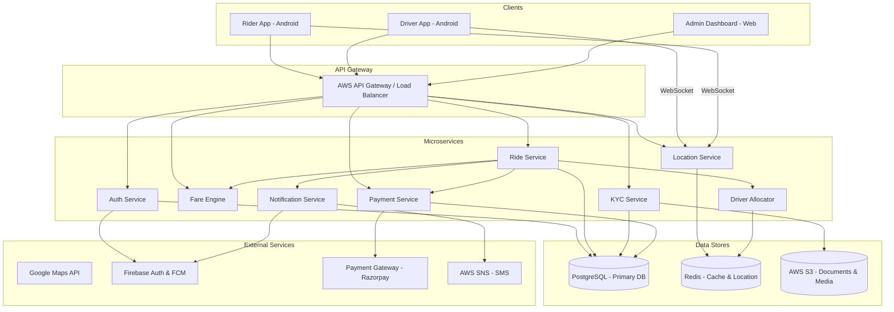

# Design Document

## Overview

Pink Auto is a ride-booking platform for auto-rickshaws, consisting of three client applications (Rider Android app, Driver Android app, Admin web dashboard) backed by a microservices architecture deployed on AWS.

The system handles the full ride lifecycle: rider authentication → ride booking → driver allocation → live tracking → fare calculation → payment → ratings. It is designed for high concurrency (10,000+ simultaneous drivers), real-time GPS streaming via WebSockets, and 99.9% uptime SLA.

**Key design principles:**
- Microservices with clear domain boundaries (Auth, Ride, Location, Fare, Payment, Notification, KYC)
- Event-driven communication between services via message queues for decoupling
- Redis for real-time location state and caching; PostgreSQL for persistent data
- Firebase for push notifications; AWS SNS for SMS
- Google Maps SDK on Android for navigation and map rendering

---

## Architecture



### Service Communication

- **Synchronous (REST/HTTP)**: Client-to-service calls via API Gateway
- **Asynchronous (SQS/SNS)**: Inter-service events (ride completed → trigger payment → trigger notification)
- **WebSocket**: Real-time GPS streaming between Driver App ↔ Location Service ↔ Rider App
- **Redis Pub/Sub**: Location updates broadcast to subscribed rider sessions

### Deployment

- Services run as Docker containers on AWS ECS (Fargate)
- PostgreSQL on AWS RDS (Multi-AZ for HA)
- Redis on AWS ElastiCache (cluster mode)
- S3 for KYC documents and profile images
- CloudFront CDN for static assets

---

## Components and Interfaces

### Auth Service

Handles registration, login (OTP, email/password, Google OAuth), JWT issuance, and session management.

```
POST /auth/rider/send-otp        { phone }
POST /auth/rider/verify-otp      { phone, otp }
POST /auth/rider/login           { email, password }
POST /auth/rider/google          { google_token }
POST /auth/driver/send-otp       { phone }
POST /auth/driver/verify-otp     { phone, otp }
POST /auth/refresh               { refresh_token }
PUT  /auth/profile               { name, photo_url, saved_addresses }
GET  /auth/profile               → UserProfile
```

JWT tokens expire after 1 hour; refresh tokens valid for 30 days. OTP TTL is 5 minutes; max 3 attempts before 15-minute lockout.

### Ride Service

Manages the full ride lifecycle: request → allocation → in-progress → completed/cancelled.

```
POST /rides/request              { pickup_lat, pickup_lng, dest_lat, dest_lng, payment_method }
POST /rides/:id/cancel           {}
GET  /rides/:id                  → Ride
POST /rides/:id/start            {}   (Driver)
POST /rides/:id/end              {}   (Driver)
GET  /rides/history              → Ride[]
```

Ride state machine: `REQUESTED → DRIVER_ASSIGNED → DRIVER_EN_ROUTE → IN_PROGRESS → COMPLETED | CANCELLED`

### Location Service

Ingests GPS updates from drivers and streams them to riders via WebSocket.

```
WS  /ws/driver/location          ← { lat, lng, heading, timestamp }
WS  /ws/rider/track/:ride_id     → { driver_lat, driver_lng, eta_seconds }
GET /location/nearby-drivers     { lat, lng, radius_km } → Driver[]
```

Driver locations stored in Redis as geo-indexed keys (`GEOADD drivers <lng> <lat> <driver_id>`). TTL of 10 seconds per key — stale drivers auto-expire.

### Fare Engine

Stateless calculation service; no persistent state of its own.

```
POST /fare/estimate              { pickup, destination, timestamp } → FareEstimate
POST /fare/final                 { ride_id } → FareBreakdown
POST /fare/validate-coupon       { code, ride_id } → DiscountResult
```

### Driver Allocator

Internal service (not exposed externally) called by Ride Service.

- Queries Redis for drivers within radius using `GEORADIUS`
- Ranks by (rating DESC, cancellation_rate ASC)
- Sends request to top driver; sets 30-second timeout in Redis
- On timeout or rejection, escalates to next candidate

### Payment Service

```
POST /payments/initiate          { ride_id, method }
POST /payments/webhook           (Razorpay webhook)
POST /payments/refund            { ride_id, reason }
GET  /payments/invoice/:ride_id  → Invoice
GET  /payments/transactions      → Transaction[]
```

### KYC Service

```
POST /kyc/submit                 { driver_id, documents: { aadhaar, license, rc, insurance, puc, bank, photo, pan? } }
GET  /kyc/:driver_id/status      → KYCStatus
PUT  /kyc/:driver_id/review      { action: approve|reject, reason? }  (Admin)
```

Documents stored in S3; metadata in PostgreSQL.

### Notification Service

Internal service triggered by events from other services.

```
POST /notify/push                { user_id, title, body, data }
POST /notify/sms                 { phone, message }
POST /notify/sos                 { rider_id, ride_id, coordinates }
```

Uses Firebase Cloud Messaging (FCM) for push; AWS SNS for SMS. Retry: up to 3 attempts with exponential backoff (1s, 2s, 4s).

### Admin Dashboard API

```
GET  /admin/rides/active         → ActiveRide[]
GET  /admin/users                { search, role, page }
PUT  /admin/drivers/:id/blacklist { reason }
GET  /admin/analytics            { from, to } → PlatformStats
PUT  /admin/pricing/:zone_id     { base_fare, per_km, per_minute, platform_fee, surge_config }
```

---

## Data Models

### User (Rider)

```sql
CREATE TABLE riders (
    id            UUID PRIMARY KEY DEFAULT gen_random_uuid(),
    phone         VARCHAR(15) UNIQUE,
    email         VARCHAR(255) UNIQUE,
    name          VARCHAR(100),
    photo_url     TEXT,
    google_id     VARCHAR(255) UNIQUE,
    created_at    TIMESTAMPTZ DEFAULT NOW(),
    updated_at    TIMESTAMPTZ DEFAULT NOW()
);

CREATE TABLE rider_saved_addresses (
    id         UUID PRIMARY KEY DEFAULT gen_random_uuid(),
    rider_id   UUID REFERENCES riders(id),
    label      VARCHAR(50),   -- "Home", "Work", etc.
    address    TEXT,
    lat        DECIMAL(9,6),
    lng        DECIMAL(9,6)
);
```

### Driver

```sql
CREATE TABLE drivers (
    id                UUID PRIMARY KEY DEFAULT gen_random_uuid(),
    phone             VARCHAR(15) UNIQUE NOT NULL,
    name              VARCHAR(100),
    photo_url         TEXT,
    kyc_status        VARCHAR(20) DEFAULT 'pending',  -- pending|under_review|active|rejected|blacklisted
    is_online         BOOLEAN DEFAULT FALSE,
    rating            DECIMAL(3,2) DEFAULT 5.00,
    cancellation_rate DECIMAL(5,4) DEFAULT 0.0,
    total_rides       INTEGER DEFAULT 0,
    created_at        TIMESTAMPTZ DEFAULT NOW()
);

CREATE TABLE driver_kyc (
    id              UUID PRIMARY KEY DEFAULT gen_random_uuid(),
    driver_id       UUID REFERENCES drivers(id),
    aadhaar_url     TEXT,
    license_url     TEXT,
    rc_url          TEXT,
    insurance_url   TEXT,
    puc_url         TEXT,
    pan_url         TEXT,
    bank_account    JSONB,
    submitted_at    TIMESTAMPTZ,
    reviewed_at     TIMESTAMPTZ,
    reviewed_by     UUID,
    rejection_reason TEXT
);
```

### OTP Session

```sql
CREATE TABLE otp_sessions (
    id           UUID PRIMARY KEY DEFAULT gen_random_uuid(),
    phone        VARCHAR(15) NOT NULL,
    otp_hash     VARCHAR(255) NOT NULL,
    attempts     INTEGER DEFAULT 0,
    locked_until TIMESTAMPTZ,
    expires_at   TIMESTAMPTZ NOT NULL,
    created_at   TIMESTAMPTZ DEFAULT NOW()
);
```

### Ride

```sql
CREATE TABLE rides (
    id               UUID PRIMARY KEY DEFAULT gen_random_uuid(),
    rider_id         UUID REFERENCES riders(id),
    driver_id        UUID REFERENCES drivers(id),
    status           VARCHAR(30) NOT NULL,  -- REQUESTED|DRIVER_ASSIGNED|DRIVER_EN_ROUTE|IN_PROGRESS|COMPLETED|CANCELLED
    pickup_lat       DECIMAL(9,6),
    pickup_lng       DECIMAL(9,6),
    pickup_address   TEXT,
    dest_lat         DECIMAL(9,6),
    dest_lng         DECIMAL(9,6),
    dest_address     TEXT,
    distance_km      DECIMAL(8,3),
    duration_minutes DECIMAL(8,2),
    payment_method   VARCHAR(30),
    requested_at     TIMESTAMPTZ DEFAULT NOW(),
    assigned_at      TIMESTAMPTZ,
    started_at       TIMESTAMPTZ,
    completed_at     TIMESTAMPTZ,
    cancelled_at     TIMESTAMPTZ,
    cancel_reason    TEXT
);

CREATE TABLE ride_gps_log (
    id         BIGSERIAL PRIMARY KEY,
    ride_id    UUID REFERENCES rides(id),
    lat        DECIMAL(9,6),
    lng        DECIMAL(9,6),
    recorded_at TIMESTAMPTZ DEFAULT NOW()
);
-- Retained for minimum 90 days (Requirement 12.4)
```

### Fare

```sql
CREATE TABLE fare_breakdowns (
    id               UUID PRIMARY KEY DEFAULT gen_random_uuid(),
    ride_id          UUID REFERENCES rides(id) UNIQUE,
    base_fare        DECIMAL(10,2),
    distance_charge  DECIMAL(10,2),
    waiting_charge   DECIMAL(10,2),
    surge_multiplier DECIMAL(4,2) DEFAULT 1.0,
    platform_fee     DECIMAL(10,2),
    discount         DECIMAL(10,2) DEFAULT 0.0,
    total_fare       DECIMAL(10,2),
    coupon_code      VARCHAR(50),
    created_at       TIMESTAMPTZ DEFAULT NOW()
);

CREATE TABLE pricing_zones (
    id               UUID PRIMARY KEY DEFAULT gen_random_uuid(),
    zone_name        VARCHAR(100),
    base_fare        DECIMAL(10,2),
    per_km_rate      DECIMAL(10,2),
    per_minute_rate  DECIMAL(10,2),
    platform_fee     DECIMAL(10,2),
    surge_threshold  DECIMAL(5,2),  -- demand/supply ratio that triggers surge
    max_surge        DECIMAL(4,2),
    geofence         JSONB          -- GeoJSON polygon
);
```

### Payment

```sql
CREATE TABLE payments (
    id                UUID PRIMARY KEY DEFAULT gen_random_uuid(),
    ride_id           UUID REFERENCES rides(id),
    rider_id          UUID REFERENCES riders(id),
    amount            DECIMAL(10,2),
    method            VARCHAR(30),
    status            VARCHAR(20),  -- pending|success|failed|refunded
    gateway_txn_id    VARCHAR(255) UNIQUE,
    failure_reason    TEXT,
    created_at        TIMESTAMPTZ DEFAULT NOW(),
    updated_at        TIMESTAMPTZ DEFAULT NOW()
);
```

### Rating

```sql
CREATE TABLE ratings (
    id          UUID PRIMARY KEY DEFAULT gen_random_uuid(),
    ride_id     UUID REFERENCES rides(id),
    rater_id    UUID NOT NULL,
    ratee_id    UUID NOT NULL,
    role        VARCHAR(10),  -- rider|driver
    stars       SMALLINT CHECK (stars BETWEEN 1 AND 5),
    comment     TEXT,
    created_at  TIMESTAMPTZ DEFAULT NOW()
);
```

### Notification Log

```sql
CREATE TABLE notification_log (
    id          BIGSERIAL PRIMARY KEY,
    user_id     UUID,
    channel     VARCHAR(10),  -- push|sms
    title       VARCHAR(255),
    body        TEXT,
    status      VARCHAR(20),  -- sent|failed|retrying
    attempts    SMALLINT DEFAULT 1,
    created_at  TIMESTAMPTZ DEFAULT NOW()
);
```


---

## Correctness Properties

*A property is a characteristic or behavior that should hold true across all valid executions of a system — essentially, a formal statement about what the system should do. Properties serve as the bridge between human-readable specifications and machine-verifiable correctness guarantees.*

### Property 1: OTP send creates a session record

*For any* valid phone number (rider or driver), calling the send-OTP endpoint should result in an OTP session record being created with a non-expired TTL and zero failed attempts.

**Validates: Requirements 1.1, 2.1**

---

### Property 2: Correct OTP produces a JWT

*For any* phone number and the OTP generated for it (within the 5-minute TTL), calling verify-OTP should return a valid, non-expired JWT token and a refresh token.

**Validates: Requirements 1.2, 2.2**

---

### Property 3: Wrong OTP is rejected and attempt count increments

*For any* phone number with an active OTP session, submitting an incorrect OTP should return an error and increment the attempt counter. After exactly 3 failed attempts, the session should be locked and further attempts should be rejected regardless of OTP value.

**Validates: Requirements 1.3, 1.4**

---

### Property 4: Email/password login round-trip

*For any* rider registered with email and password, submitting those credentials to the login endpoint should return a valid JWT. Submitting wrong credentials should return an authentication error.

**Validates: Requirements 1.5**

---

### Property 5: Google OAuth login produces a JWT

*For any* valid Google OAuth token (mocked in tests), the Google sign-in endpoint should return a valid JWT and create or retrieve the associated rider account.

**Validates: Requirements 1.6**

---

### Property 6: Expired JWT is rejected

*For any* JWT whose expiry timestamp is in the past, all protected API endpoints should return HTTP 401 Unauthorized.

**Validates: Requirements 1.7**

---

### Property 7: Non-active driver cannot go online

*For any* driver whose kyc_status is not 'active' (i.e., pending, under_review, rejected, or blacklisted), the go-online endpoint should return an error and leave is_online as false.

**Validates: Requirements 2.3**

---

### Property 8: KYC submission transitions status to under_review

*For any* driver in pending status, submitting a complete KYC document set (with or without the optional PAN card) should transition kyc_status to 'under_review' and store all document references.

**Validates: Requirements 2.4, 2.7**

---

### Property 9: KYC approval and rejection transitions

*For any* driver in under_review status, admin approval should transition kyc_status to 'active'. Admin rejection with a provided reason should transition kyc_status to 'rejected' and store the reason. Admin rejection without a reason should be rejected by the API.

**Validates: Requirements 2.5, 2.6, 15.3**

---

### Property 10: Profile update round-trip

*For any* rider or driver, submitting a valid profile update (name, photo, saved addresses for riders; photo and contact for drivers) should persist the changes such that a subsequent GET profile returns the updated values.

**Validates: Requirements 3.1, 3.2, 3.3**

---

### Property 11: Nearby drivers query returns only online drivers within radius

*For any* geographic coordinate and radius, the nearby-drivers endpoint should return only drivers whose is_online is true and whose stored GPS coordinates fall within the specified radius. Offline drivers and drivers outside the radius must not appear.

**Validates: Requirements 4.4, 6.1**

---

### Property 12: Fare estimate contains all required fields

*For any* valid pickup and destination coordinate pair, the fare estimate endpoint should return a response containing a non-negative estimated fare, a positive distance in km, and a positive ETA in seconds.

**Validates: Requirements 5.1**

---

### Property 13: Ride cancellation before assignment has no fare

*For any* ride in REQUESTED status (no driver assigned), cancelling the ride should transition its status to CANCELLED and result in no fare breakdown record and no payment record being created.

**Validates: Requirements 5.6**

---

### Property 14: Driver allocation escalation

*For any* ride request, if the highest-priority available driver either explicitly rejects the request or does not respond within 30 seconds, the Driver Allocator should offer the request to the next-highest-priority available driver. Drivers currently on an active ride must never be included in the candidate set.

**Validates: Requirements 6.2, 6.3, 6.4, 6.5, 10.3**

---

### Property 15: Location streaming only during active rides

*For any* ride, the Location Service WebSocket should only emit driver GPS updates when the ride status is DRIVER_EN_ROUTE or IN_PROGRESS. No updates should be emitted for rides in REQUESTED, COMPLETED, or CANCELLED status.

**Validates: Requirements 7.1**

---

### Property 16: Fare formula correctness

*For any* combination of base_fare, per_km_rate, distance_km, per_minute_rate, and waiting_minutes (all non-negative), the Fare Engine should compute: `fare = base_fare + (per_km_rate × distance_km) + (per_minute_rate × waiting_minutes)`. When a surge multiplier > 1 is active, the result should equal `fare × surge_multiplier`. The surge multiplier value must be included in the fare breakdown.

**Validates: Requirements 8.1, 8.2**

---

### Property 17: Discount reduces fare and platform fee is always present

*For any* valid coupon code applied to a fare, the final fare should be strictly less than or equal to the fare without the coupon. For any completed ride fare breakdown, the platform_fee field must be positive and the breakdown must contain all required fields: base_fare, distance_charge, waiting_charge, surge_multiplier, platform_fee, and discount.

**Validates: Requirements 8.3, 8.4, 8.5**

---

### Property 18: Pricing config round-trip

*For any* pricing zone, updating the pricing configuration (base_fare, per_km_rate, per_minute_rate, platform_fee, surge thresholds) should result in subsequent fare calculations for rides in that zone using the new rates.

**Validates: Requirements 8.6, 15.5**

---

### Property 19: Payment created on ride completion with unique transaction ID

*For any* completed ride, a payment record should be created with a non-null gateway_txn_id that is unique across all payment records. If the payment fails, the record should contain a non-null failure_reason and status='failed'.

**Validates: Requirements 9.2, 9.4, 9.6**

---

### Property 20: Invoice generated on successful payment

*For any* payment with status='success', an invoice record should exist and be retrievable via the invoice endpoint.

**Validates: Requirements 9.3**

---

### Property 21: Refund record created on approval

*For any* approved refund, a payment record with status='refunded' should exist referencing the original ride.

**Validates: Requirements 9.5**

---

### Property 22: Driver online/offline state consistency

*For any* driver, toggling to online should set is_online=true and register them in the Location Service geo-index. Toggling to offline should set is_online=false and remove them from the geo-index, making them invisible to the Driver Allocator.

**Validates: Requirements 10.1, 10.7**

---

### Property 23: Ride status transitions are valid

*For any* ride, calling start-ride on a DRIVER_EN_ROUTE ride should transition it to IN_PROGRESS. Calling end-ride on an IN_PROGRESS ride should transition it to COMPLETED and trigger payment processing. Invalid transitions (e.g., end-ride on a REQUESTED ride) should return an error.

**Validates: Requirements 10.5, 10.6**

---

### Property 24: Driver earnings calculation correctness

*For any* driver and time period, the earnings total returned by the dashboard endpoint should equal the sum of total_fare values from all COMPLETED rides assigned to that driver within the period.

**Validates: Requirements 11.1, 11.2**

---

### Property 25: SOS triggers notifications to all emergency contacts

*For any* rider with registered emergency contacts, activating SOS during an active ride should create notification records for every emergency contact and for platform support, each containing the rider's name, current GPS coordinates, and ride ID.

**Validates: Requirements 12.2**

---

### Property 26: GPS log exists for every ride

*For any* completed or cancelled ride, at least one ride_gps_log entry should exist for that ride_id.

**Validates: Requirements 12.4**

---

### Property 27: Blacklisted driver cannot go online

*For any* driver that has been blacklisted (with a recorded reason and timestamp), the go-online endpoint should return an error. The blacklist record must contain a non-null reason and a non-null timestamp.

**Validates: Requirements 12.5, 15.6**

---

### Property 28: Rating submission and rolling average

*For any* set of star ratings submitted for a driver, the driver's stored rating should equal the arithmetic mean of all submitted ratings rounded to two decimal places. When the rolling average drops below 3.5, the driver's account should have a flag indicating it is under admin review.

**Validates: Requirements 13.1, 13.2, 13.3, 13.4**

---

### Property 29: Notification delivery on ride events

*For any* ride event (driver assigned, driver arrived, ride completed, new request for driver), a notification log record should be created for the relevant user. If delivery fails, the retry count should increment up to a maximum of 3, after which the record should be marked as failed.

**Validates: Requirements 14.1, 14.2, 14.3, 14.5, 14.6**

---

### Property 30: SMS created for OTP requests

*For any* OTP send request, an SMS notification log record should be created for the target phone number.

**Validates: Requirements 14.4**

---

### Property 31: Admin active rides list completeness

*For any* set of rides in non-terminal status (REQUESTED, DRIVER_ASSIGNED, DRIVER_EN_ROUTE, IN_PROGRESS), the admin active rides endpoint should return all of them and none of the COMPLETED or CANCELLED rides.

**Validates: Requirements 15.1**

---

### Property 32: Admin user search returns matching accounts only

*For any* search query submitted to the admin user search endpoint, all returned accounts should match the query (by name, phone, or email) and no non-matching accounts should be included.

**Validates: Requirements 15.2**

---

### Property 33: Analytics reflect actual data for date range

*For any* date range, the platform analytics endpoint should return total_rides equal to the count of COMPLETED rides in that range, and total_revenue equal to the sum of their fares.

**Validates: Requirements 15.4**

---

## Error Handling

### Auth Service

- Invalid/expired OTP → HTTP 400 with `OTP_INVALID` or `OTP_EXPIRED` error code
- OTP session locked → HTTP 429 with `OTP_LOCKED` and `locked_until` timestamp
- Invalid JWT → HTTP 401 with `TOKEN_INVALID`
- Expired JWT → HTTP 401 with `TOKEN_EXPIRED`
- Duplicate email/phone on registration → HTTP 409 with `ACCOUNT_EXISTS`

### Ride Service

- Ride request with no available drivers → HTTP 200 with `no_drivers_available` flag; async cancellation after 2-minute timeout
- Invalid ride state transition → HTTP 409 with `INVALID_STATE_TRANSITION` and current status
- Cancellation after driver assigned → HTTP 200 with cancellation fee applied if applicable

### Location Service

- Stale driver location (no update in 10s) → driver auto-removed from Redis geo-index
- WebSocket disconnect → client receives `reconnecting` event; server buffers last known position for 30 seconds

### Fare Engine

- Unknown zone for coordinates → fall back to default pricing zone
- Invalid coupon code → HTTP 400 with `COUPON_INVALID`
- Expired coupon → HTTP 400 with `COUPON_EXPIRED`

### Payment Service

- Gateway timeout → payment status set to `pending`; webhook reconciliation resolves final status
- Duplicate payment attempt → idempotency key check; return existing payment record
- Refund on cash payment → HTTP 400 with `REFUND_NOT_APPLICABLE`

### KYC Service

- Missing required document → HTTP 400 with list of missing fields
- Unsupported file type → HTTP 415
- File size exceeded → HTTP 413

### Notification Service

- FCM token invalid → mark token as stale; skip push, log failure
- SMS delivery failure → retry up to 3 times with exponential backoff (1s, 2s, 4s); log final failure

### General

- All services return errors in a consistent envelope: `{ "error": { "code": "...", "message": "...", "details": {} } }`
- Unhandled exceptions → HTTP 500 with `INTERNAL_ERROR`; full stack trace logged to CloudWatch, not exposed to client
- Rate limiting → HTTP 429 with `Retry-After` header

---

## Testing Strategy

### Dual Testing Approach

Both unit tests and property-based tests are required. They are complementary:
- Unit tests catch concrete bugs with specific inputs and verify integration points
- Property tests verify universal correctness across randomized inputs

### Unit Tests

Focus on:
- Specific examples for each API endpoint (happy path + error cases)
- Integration between services (e.g., ride completion triggers payment + notification)
- Edge cases: OTP lockout boundary (exactly 3 failures), surge threshold boundary, empty driver pool
- State machine transitions: valid and invalid ride status transitions

### Property-Based Tests

**Library**: [Kotest](https://kotest.io/docs/proptest/property-based-testing.html) for Kotlin (Android), [fast-check](https://fast-check.io/) for Node.js backend services, [Hypothesis](https://hypothesis.readthedocs.io/) for Python services.

Each property test must run a minimum of **100 iterations**.

Each test must be tagged with a comment in the format:
```
// Feature: pink-auto, Property N: <property_text>
```

**Property test mapping:**

| Property | Test Description | Library |
|---|---|---|
| P1 | OTP send creates session record | Kotest / fast-check |
| P2 | Correct OTP produces JWT | Kotest / fast-check |
| P3 | Wrong OTP rejected, lockout after 3 | Kotest / fast-check |
| P4 | Email/password login round-trip | Kotest / fast-check |
| P5 | Google OAuth login produces JWT | Kotest / fast-check |
| P6 | Expired JWT rejected on all endpoints | Kotest / fast-check |
| P7 | Non-active driver cannot go online | Kotest / fast-check |
| P8 | KYC submission transitions to under_review | Kotest / fast-check |
| P9 | KYC approval/rejection transitions | Kotest / fast-check |
| P10 | Profile update round-trip | Kotest / fast-check |
| P11 | Nearby drivers query correctness | fast-check |
| P12 | Fare estimate contains required fields | fast-check |
| P13 | Ride cancellation before assignment has no fare | fast-check |
| P14 | Driver allocation escalation | fast-check |
| P15 | Location streaming only during active rides | fast-check |
| P16 | Fare formula correctness | fast-check |
| P17 | Discount reduces fare; platform fee always present | fast-check |
| P18 | Pricing config round-trip | fast-check |
| P19 | Payment created on completion with unique txn ID | fast-check |
| P20 | Invoice generated on successful payment | fast-check |
| P21 | Refund record created on approval | fast-check |
| P22 | Driver online/offline state consistency | fast-check |
| P23 | Ride status transitions are valid | fast-check |
| P24 | Driver earnings calculation correctness | fast-check |
| P25 | SOS triggers notifications to all emergency contacts | fast-check |
| P26 | GPS log exists for every ride | fast-check |
| P27 | Blacklisted driver cannot go online | fast-check |
| P28 | Rating submission and rolling average | fast-check |
| P29 | Notification delivery on ride events | fast-check |
| P30 | SMS created for OTP requests | fast-check |
| P31 | Admin active rides list completeness | fast-check |
| P32 | Admin user search returns matching accounts only | fast-check |
| P33 | Analytics reflect actual data for date range | fast-check |

### Integration Tests

- End-to-end ride flow: rider books → driver accepts → ride completes → payment processed → ratings submitted
- WebSocket connection lifecycle: connect → receive updates → disconnect → reconnect
- KYC flow: submit → admin review → approve → driver goes online

### Load Tests

- Location Service: simulate 10,000 concurrent GPS update WebSocket connections (AWS load testing with Artillery)
- Ride Service: 1,000 concurrent ride requests to verify 2-second acknowledgement SLA
- Auth Service: 5,000 concurrent OTP verifications to verify 1-second response SLA
